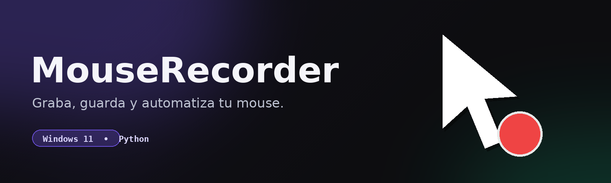

<p align="center">
  
  
  
  
  
  
</p>

<p align="center">
  <h1 align="center">MouseRecorder — Record & automate your mouse</h1>
</p>

<p align="center">
  
</p>

<p align="center">
  Minimalist Windows 11 desktop app. Record your mouse movements and clicks, save the recording, and replay it with a keyboard shortcut.
</p>

---

## 📑 Table of Contents

- [✨ Features](#-features)
- [🎯 Goal](#-goal)
- [🚀 Quick Start](#-quick-start)
  - [Requirements](#requirements)
  - [Steps](#steps)
- [🎮 How to Use](#-how-to-use)
- [📚 Documentation](#-documentation)
  - [Tech Stack](#tech-stack)
  - [Project Structure](#project-structure)
  - [.mrcd File Format](#mrcd-file-format)
- [🔧 Troubleshooting](#-troubleshooting)
- [📝 Changelog](#-changelog)

---

## ✨ Features

| Feature                    | Description |
| -------------------------- | ----------- |
| 🔴 **Record Mouse**        | Captures mouse movement, clicks, and scroll in real-time |
| ⏹️ **Stop**                | Ends the current recording |
| ▶️ **Playback**            | Replays the last recording with exact timing |
| 💾 **Save**                | Exports the recording as a reusable `.mrcd` file |
| 📂 **Load**                | Imports a `.mrcd` recording from disk |
| ⌨️ **Global Hotkeys**      | F9 = replay, F10 = record/stop, ESC = cancel |
| 🎮 **Game Mode**           | Toggle for DirectInput games — sends clicks without injection flag |
| 🔔 **Toast Watcher**       | Detects Windows notifications and auto-plays recording on death |
| ✏️ **Rename Recordings**   | Double-click any recording in the list to rename it |
| 🎨 **Monochrome dark UI**  | Near-black backgrounds with high-contrast text |

---

## 🎯 Goal

Automate repetitive mouse actions without complex software. Ideal for:

- Mechanical tasks in spreadsheets
- Form filling
- Repeating click sequences in apps
- UI flow demos

---

## 🚀 Quick Start

### Requirements

- **Windows 10/11**
- **Python 3.11 or higher** (download from [python.org](https://www.python.org/downloads/))
  - ⚠️ During install, check **"Add Python to PATH"**

### Steps

1. **Open the project folder** in Windows Explorer.

2. **Double-click `ejecutar.bat`**
   - First run creates a virtual environment and installs dependencies (takes 1-2 minutes).
   - Subsequent runs launch the app directly.
   - If something fails, the `.bat` shows an on-screen message and stays paused so you can read the error.

3. **Done.** The MouseRecorder window opens.

> To generate a portable `.exe`: double-click `compilar.bat` → result at `dist\MouseRecorder.exe`.

---

## 🎮 How to Use

| Action                     | How |
| -------------------------- | --- |
| Start recording            | Click **🔴 Record** |
| Stop recording             | Click **⏹️ Stop** |
| Replay last recording      | Click **▶️ Play** |
| Save to disk               | Click **💾 Save** → type a name → Enter |
| Load from disk             | Click **📂 Load** → choose a `.mrcd` |
| Record/Stop with keyboard  | Press **F10** (toggles record/stop) |
| Playback with keyboard     | Press **F9** anytime |
| Cancel playback            | Press **ESC** |
| Rename a recording         | **Double-click** its name in the list |
| Auto-play on death         | Enable **Auto** checkbox — replays recording when game death notification is detected |
| Playback in games          | Check **Game mode** before playing — clicks bypass DirectInput detection |

> **For games (Mu Online, etc.):** Right-click `ejecutar.bat` → **Run as administrator**. Games often run elevated and Windows blocks input hooks from non-admin apps. Check **Game mode** to ensure clicks are injected without the "virtual input" flag that games detect.

Files are stored in the `recordings\` folder next to the executable.

---

## 📚 Documentation

### Tech Stack

| Layer          | Technology                        |
| -------------- | --------------------------------- |
| Language       | Python 3.11+                      |
| UI             | PySide6 (Qt 6)                    |
| Style / Theme  | Solid dark QSS with desaturated palette (#0d1117) |
| Mouse Hooks    | pynput                            |
| Packaging      | PyInstaller → standalone `.exe`   |
| Data format    | JSON (`.mrcd`)                    |

### Project Structure

```
08_MouseRecorder/
├── main.py                 # Entry point
├── ejecutar.bat            # Double-click → prepares venv and launches app
├── compilar.bat            # Double-click → builds MouseRecorder.exe
├── diagnostico.bat         # Double-click → shows Python/venv/package info
├── assets/
│   ├── icon.ico            # App icon
│   └── banner.png          # README banner
├── recordings/             # Saved .mrcd files
│   └── .gitkeep
└── src/
    ├── ui/
    │   ├── app.py          # Frameless main window
    │   ├── theme.py        # Dark palette + QSS
    │   └── widgets.py      # PanelCard, GlowButton, StatusPill
    ├── core/
    │   ├── recorder.py     # Captures mouse events (pynput)
    │   ├── player.py       # Replays events with real timing
    │   ├── storage.py      # Save/load .mrcd
    │   └── hotkey.py       # Global F9 listener
    └── utils/
        └── paths.py        # recordings/ and assets/ paths
```

### .mrcd File Format

```json
{
  "version": 1,
  "name": "my macro",
  "created_at": "2026-06-01T12:00:00",
  "events": [
    {"t": 0,   "type": "move",   "x": 100, "y": 200},
    {"t": 150, "type": "click",  "x": 100, "y": 200, "button": "left"},
    {"t": 300, "type": "scroll", "x": 100, "y": 200, "dx": 0, "dy": -1}
  ]
}
```

- `t` = milliseconds since recording start
- Types: `move`, `click`, `scroll`
- Manually editable if you need to adjust timing

---

## 🔧 Troubleshooting

### Known Windows-specific errors

| On-screen symptom                                      | Root cause | Fix |
| ------------------------------------------------------ | ---------- | --- |
| `Python not found` or window closes instantly     | The `python.exe` Windows finds is the **Microsoft Store stub** (non-functional) | Reinstall Python from [python.org](https://www.python.org/downloads/) unchecking "Microsoft Store" and removing the Store stub. Or use the version the .bat finds at `%LOCALAPPDATA%\Programs\Python\Python3XX\`. |
| `... was unexpected at this time`                  | The `.bat` had `...` at the end of an `echo` — `cmd` reads it as a wildcard | Fixed in v0.1.3. If it reappears, send the `last_run.log`. |
| `The syntax of the command is incorrect`              | The `.bat` had `|` at the end of an `echo` — `cmd` reads it as a pipe operator | Fixed in v0.1.4. If it reappears, send the `last_run.log`. |
| Crash with code `-1073741819` when clicking **Play**  | The player thread was touching Qt widgets directly | Fixed in v0.1.5 with `Signal.emit()`. If it reappears, send the `last_run.log`. |
| The `.bat` opens and closes instantly with no visible output | Many possible causes; there's always a `last_run.log` with details | Double-click `diagnostico.bat` → send me the output. |

### General issues

| Problem                                       | Solution |
| --------------------------------------------- | -------- |
| "Python is not recognized as a command"       | Reinstall Python checking **"Add Python to PATH"**. Or run `diagnostico.bat` to see what it found. |
| App doesn't detect clicks                     | Try running as **Administrator** (right-click `ejecutar.bat` → "Run as administrator"). Games often run elevated and block hooks from non-admin apps. |
| Clicks not working in-game during playback    | Check **Game mode** in the app. This removes the "injected" flag from clicks so DirectInput games don't ignore them. Also run as admin. |
| Antivirus blocks the `.exe`                   | Add an exception for the `dist\` folder |
| White/light background instead of dark        | Previous versions used translucent Mica/Acrylic that picked up the wallpaper color. Update to v0.1.8+ which uses solid dark background |
| F9 doesn't respond                            | Some app is capturing F9. Change it in the code (`src/core/hotkey.py`) |
| `pip install` fails                           | No internet, firewall blocking, or permission issues. Try as Administrator. |
| Cmd window disappears, can't read error       | There's always a `last_run.log` in the folder. Open it with Notepad. |

### How to ask for help

1. Double-click `diagnostico.bat` → send me the full output.
2. Open `last_run.log` with Notepad → send me its contents.
3. Tell me what you were doing when the error occurred.

---


---

## 📝 Changelog

### v0.1.11 — Toast notification watcher + F10 hotkey + auto-play (2026-06-09)
- **Add:** `NotificationWatcher` — polls `wpndatabase.db` for new Windows Toast notifications. Detects all app notifications in real-time.
- **Add:** **Auto** checkbox — when enabled, auto-plays the last recording on detecting death notification (keywords: died/death/killed/muerto/moriste).
- **Add:** **F10** global hotkey — toggles record/stop from any app.
- **Add:** **Rename** — double-click any recording in the list to rename it (updates file name + internal metadata).
- **Redesign:** Monochrome dark theme — near-black `#050505` backgrounds, pure white `#f5f5f5` text, neutral gray accents, minimal color noise.
- **Refactor:** `NotificationWatcher` watches all apps (no hardcoded AppId). Callback includes `app_id` for future filtering.

### v0.1.10 — Game mode + DirectInput click injection (2026-06-06)
- **Add:** "Game mode" toggle in UI — enables two behaviors for game compatibility:
  - Recording: acknowledges admin requirement for elevated game processes (UIPI bypass). User must run the app as Administrator for games.
  - Playback: clicks sent via `SendInput` with `dwExtraInfo=0` instead of pynput's default `LLMHF_INJECTED` flag. Games using DirectInput often detect and ignore injected clicks — this makes them look like real hardware events.
- **Fix:** Cleaned up experimental Raw Input code that caused crashes on stop.
- **Docs:** Added game recording/playback guide to README troubleshooting.

### v0.1.9 — F9 hotkey fix + race condition fix (2026-06-03)
- **Fix:** F9 hotkey now works correctly. `QTimer.singleShot(0, callback)` was creating the timer on the pynput thread (no Qt event loop), so the callback never fired. Replaced with `Signal.emit()` on `_PlayerBridge` which is thread-safe and queues the slot onto the UI thread.
- **Fix:** Race condition in `recorder.stop()` — the daemon thread captured `self._listener` by reference, so if `start()` was called before the daemon ran, it would stop the *new* listener instead of the old one.
- **Fix:** Hotkey callbacks now read under the lock in `hotkey.py`, consistent with `set_callbacks()`.
- **Docs:** Updated `AGENTS.md` with the corrected threading pattern: `QTimer.singleShot` is NOT safe from foreign threads.

### v0.1.8 — UI redesign: solid dark theme (2026-06-01)
- **Redesign:** Removed translucent Mica/Acrylic effect that made the window appear "white" depending on the wallpaper.
- **Redesign:** New solid dark palette `#0d1117` (GitHub Dark inspired) with high contrast.
- **Redesign:** Desaturated accent colors — blue `#58a6ff`, red `#da3633`, green `#3fb950`.
- **Removed:** `WA_TranslucentBackground`, `DwmSetWindowAttribute`, all Mica/Acrylic logic.
- **Fix:** All text has ≥4.5:1 contrast, including secondary and muted.
- **Fix:** `GlassCard` renamed to `panelCard` in QSS, visible borders, solid backgrounds.
- **Fix:** Buttons with clearly differentiated hover/pressed/disabled states.
- **Fix:** StatusPill, lists, inputs, scrollbars with visible solid backgrounds and borders.

### v0.1.7 — Crash diagnostics + thread-safety hardening (2026-06-01)
- **Add:** `faulthandler` + `sys.excepthook` in `main.py` — captures full stack traces in `crash_traceback.log` on segfaults or unhandled exceptions.
- **Fix:** `_handle_hotkey_cancel` now deferred to the UI thread via `QTimer.singleShot(0, ...)`, same as `_handle_hotkey_play` — eliminates potential race condition with the pynput thread.
- **Fix:** `recorder.stop()` no longer blocks the UI thread — stops the pynput listener in a separate daemon thread.
- **Fix:** Invalid selector `#titleBtn#close` (duplicate ID in QSS) replaced with property selector `[class="close"]`.
- **Fix:** Removed redundant `setStyleSheet()` on `_btn_load` that could confuse the QSS parser.
- **Fix:** `ejecutar.bat` now prefers Python 3.12 over 3.13 for proven PySide6 stability.
- **Add:** `crash_traceback.log` in `.gitignore` (covered by `*.log`).

### v0.1.6 — Hard-won lessons documentation
- **Docs:** Documentation of the 7 most costly bugs in `AGENTS.md` + `README.md` cleanup.
- **Note:** No code changes. Existing crashes from v0.1.5 (only documented).

### v0.1.5 — Thread-safety with Qt Signals
- **Fix:** Crash with code `-1073741819` when clicking **Play**.
- **Root cause:** The player thread was touching Qt widgets directly.
- **Solution:** `_PlayerBridge(QObject)` with Signals that route to the UI thread.

### v0.1.4 — Fix pipe character in .bat
- **Fix:** `La sintaxis del comando no es correcta` when running `ejecutar.bat`.
- **Root cause:** `|` (pipe operator) at the end of an `echo`.
- **Solution:** Removed. All `.bat` files are now pure ASCII.

### v0.1.3 — Fix wildcard in .bat
- **Fix:** `No se esperaba ... en este momento` on launch.
- **Root cause:** `...` at the end of an `echo` — `cmd` reads it as a wildcard.
- **Solution:** Replaced with non-special characters.

### v0.1.2 — File logging and wrapper
- **Add:** `last_run.log` with timestamped steps.
- **Add:** `iniciar.cmd` — wrapper that forces an open window.
- **Add:** `diagnostico.bat` — support script.

### v0.1.1 — Real Python detection
- **Fix:** `ejecutar.bat` closed instantly.
- **Root cause:** `where python` resolved to the Microsoft Store stub.
- **Solution:** Search in `%LOCALAPPDATA%\Programs\Python\Python*` with priority version.

### v0.1.0 — Initial release
- Mouse recording and playback with real timing
- `.mrcd` (JSON) format
- Dark glass UI with Mica/Acrylic on Win11
- Global F9 hotkey
- Build to `.exe` with PyInstaller

---

## 📄 License

MIT — see [LICENSE](LICENSE).
